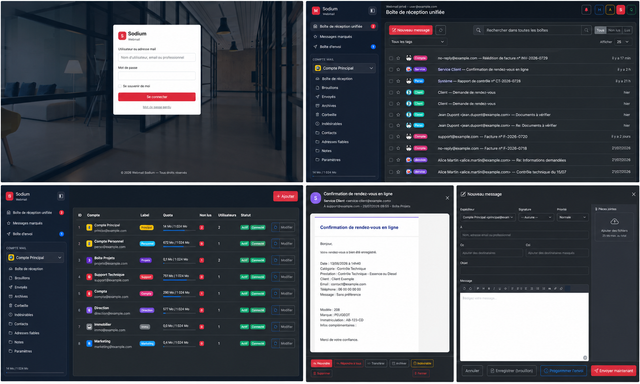

# Sodium Webmail

`Version 0.9.3 bêta`

Sodium est un webmail professionnel multi-utilisateurs et multi-comptes. Il centralise des boîtes IMAP dans une interface unifiée et permet de consulter, classer, rédiger, programmer et suivre les messages selon des habilitations précises.

## Aperçu



L’interface réunit l’authentification, la boîte de réception unifiée, la gestion multi-comptes, la lecture sécurisée et le rédacteur de messages dans un environnement responsive disponible en modes clair et sombre.

## Fonctionnalités principales

- boîte de réception unifiée et navigation par compte et dossier ;
- comptes IMAP et SMTP provenant de plusieurs domaines ou hébergements ;
- compteurs de messages non lus et synchronisation périodique ;
- lecture sécurisée des messages et contrôle des images distantes ;
- aperçu et téléchargement des pièces jointes, dont téléchargement groupé en ZIP ;
- rédaction HTML, pièces jointes par glisser-déposer, Cc, Cci et priorité ;
- réponses, réponses à tous, transferts et regroupement par conversations ;
- brouillons, envois programmés, annulation différée et boîte d’envoi ;
- signatures, tags et modèles personnels ou partagés ;
- réponses automatiques et périodes d’absence ;
- contacts suggérés à partir des correspondants connus ;
- messages marqués, filtres lu/non lu et actions multiples ;
- notifications de bureau et Web Push ;
- thèmes clair et sombre, interface responsive et PWA ;
- gestion autonome des utilisateurs, comptes, habilitations et paramètres d’instance ;
- obligation 2FA configurable individuellement par utilisateur ;
- protection Cloudflare Turnstile administrable depuis les paramètres de sécurité ;
- choix du transport des notifications système : SMTP Sodium, API Brevo ou fonction PHP `mail()` ;
- contrôle de la dernière exécution du cron avec commande cPanel prête à copier ;
- activation par licence liée au domaine.

## Prérequis serveur

- serveur web Apache 2.4 compatible `.htaccess` et HTTPS ;
- PHP 8.2 ou version ultérieure ;
- MySQL 8 ou MariaDB 10.5 ou version ultérieure — une base SQL est obligatoire, Sodium ne peut pas fonctionner sans base de données ;
- accès sortant HTTPS vers le serveur de licences et, si activé, Cloudflare Turnstile ;
- accès réseau aux serveurs IMAP et SMTP configurés ;
- tâche cron exécutable au minimum une fois par minute ;
- certificat TLS valide sur le domaine d’installation.

### Extensions PHP obligatoires

- `imap` ;
- `pdo_mysql` ;
- `openssl` ;
- `curl` ;
- `mbstring` ;
- `fileinfo` ;
- `zip` ;
- `json` ;
- `iconv`.

Le wizard vérifie automatiquement ces dépendances avant l’installation.

### Base de données et droits SQL

Sodium nécessite une base MySQL ou MariaDB dédiée. La base et l’utilisateur SQL doivent être créés avant de lancer le wizard. L’utilisateur SQL doit disposer, uniquement sur la base Sodium, des droits suivants :

```text
ALTER
CREATE
DELETE
INSERT
SELECT
UPDATE
```

Ces six privilèges couvrent la création initiale des tables, les migrations de colonnes et le fonctionnement courant de Sodium. Aucun droit sur les routines, vues, triggers, événements, tables temporaires ou autres bases n’est requis.

Il n’est pas nécessaire d’accorder des privilèges globaux, la gestion des utilisateurs SQL ou l’accès aux autres bases du serveur.

## Composants d’interface

- Bootstrap `5.3.3`, fourni localement ;
- Bootstrap Icons `1.11.3`, fourni localement ;
- JavaScript natif, sans framework applicatif ;
- PWA avec manifeste et service worker.

DataTables n’est pas requis par Sodium.

## Installation

1. Déployer le contenu du produit à la racine du domaine.
2. Faire pointer le domaine vers cette racine et activer HTTPS.
3. Créer une base MySQL ou MariaDB vide et un utilisateur disposant des droits nécessaires sur cette base.
4. Ouvrir le domaine dans un navigateur.
5. Suivre le wizard : accueil et thème, dépendances, licence, activation, base SQL, administrateur et sécurité.
6. Configurer le premier compte mail depuis `Administration > Comptes mails`.
7. Configurer la tâche cron de traitement des envois.

Le domaine détecté doit être préalablement et exclusivement affecté à la clé dans le gestionnaire de licences Jessy System.

## Tâche cron

Le traitement des brouillons programmés, de la file d’envoi et des opérations différées utilise :

```text
https://votre-domaine.example/cron/send-mail-queue.php?token=VOTRE_JETON_CRON
```

Le jeton est généré durant l’installation et conservé dans `config.local.php`. Une exécution toutes les minutes est recommandée. Ne publiez jamais ce jeton et ne l’inscrivez pas dans un dépôt de code.

Exemple cPanel :

```cron
* * * * * curl --fail --silent --show-error "https://votre-domaine.example/cron/send-mail-queue.php?token=VOTRE_JETON_CRON" >/dev/null
```

## Configuration de la messagerie

Chaque boîte requiert :

- une adresse et un nom d’affichage ;
- un serveur, un port et un mode de chiffrement IMAP ;
- un serveur, un port et un mode de chiffrement SMTP ;
- un identifiant et un mot de passe ;
- éventuellement un label, une couleur et une icône PNG ou WebP.

Les mots de passe de messagerie sont chiffrés en AES-256-GCM à l’aide d’une clé propre à l’instance.

### Notifications système et mot de passe perdu

Dans `Administration > Paramètres généraux`, choisissez le transport utilisé pour les notifications et les codes de récupération :

- **Compte mail Sodium** : utilise les paramètres SMTP d’un compte mail actif ;
- **API Brevo** : nécessite une adresse expéditeur validée chez Brevo et une clé API, stockée chiffrée ;
- **PHP mail()** : choix initial par défaut, sous réserve que la fonction soit correctement configurée par l’hébergeur.

Si le transport sélectionné n’est pas utilisable, Sodium n’annonce pas l’envoi d’un code et indique clairement que la procédure de mot de passe perdu est indisponible. L’envoi PHP doit faire l’objet d’un contrôle de délivrabilité et d’une configuration correcte de SPF et DKIM.

## Sécurité

Sodium met notamment en œuvre :

- HTTPS obligatoire et HSTS ;
- cookies de session `Secure`, `HttpOnly` et `SameSite` ;
- protection CSRF des opérations modificatrices ;
- politique CSP, protection anti-framing et `Permissions-Policy` ;
- chiffrement des secrets de messagerie ;
- contrôle d’accès par utilisateur, aptitude et compte mail ;
- authentification à deux facteurs ;
- Cloudflare Turnstile facultatif, mais vivement recommandé pour la connexion et la récupération de mot de passe ;
- masquage des erreurs techniques côté client ;
- contrôle de licence lié au domaine.

Les fichiers `config.local.php`, `.sodium-mail-key` et `.installed` sont confidentiels, exclus de l’accès HTTP et doivent être sauvegardés dans un emplacement sécurisé.

## Navigateurs

Sodium vise les versions modernes de Chrome, Edge, Firefox et Safari sur ordinateur, tablette et mobile. Les notifications Web Push dépendent des capacités et des autorisations du navigateur et du système d’exploitation.

## Sauvegarde

Une sauvegarde complète doit inclure :

- la base SQL ;
- `config.local.php` ;
- `.sodium-mail-key` ;
- les icônes de comptes téléversées et les autres fichiers applicatifs persistants.

Sans `.sodium-mail-key`, les mots de passe de messagerie déjà chiffrés ne pourront pas être récupérés.

## Mise à jour

Avant toute mise à jour :

1. sauvegarder la base et les fichiers confidentiels ;
2. vérifier la compatibilité de PHP et des extensions ;
3. déployer les nouveaux fichiers sans écraser `config.local.php` ni `.sodium-mail-key` ;
4. vider ou renouveler le cache PWA si la version du service worker change ;
5. contrôler la connexion, la relève IMAP, l’envoi SMTP et la tâche cron.

## Licence

Sodium est un logiciel propriétaire édité par Jessy System. Son installation et son utilisation nécessitent une licence valide affectée au domaine. Consultez [LICENSE.md](LICENSE.md) pour les conditions générales applicables.

Copyright © 2026 Jessy System — Tous droits réservés.
